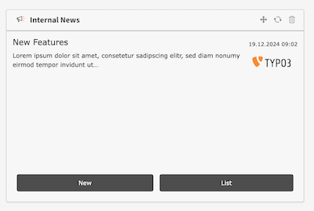
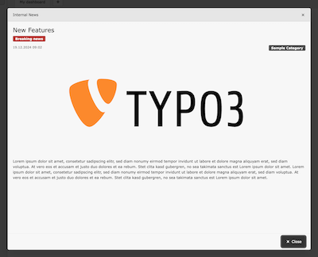
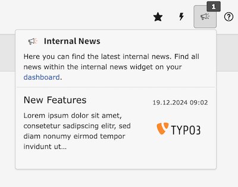

<div align="center">


# TYPO3 extension `xima_typo3_internal_news`

[](https://extensions.typo3.org/extension/xima_typo3_internal_news)
[](https://extensions.typo3.org/extension/xima_typo3_internal_news)
[](https://coveralls.io/github/xima-media/xima-typo3-internal-news)
[](https://github.com/xima-media/xima-typo3-internal-news/actions/workflows/cgl.yml)
[](https://github.com/xima-media/xima-typo3-internal-news/actions/workflows/tests.yml)
[](LICENSE.md)

</div>

This extension provides an internal news system with custom access and notification capabilities for the TYPO3 backend, e.g. to inform editors about new features and changes in the cms.


## ✨ Features

* Create, edit and delete internal news records
* Define custom dates within news to notify backend users for specific events, e.g. next maintanance
* Assign news to specific backend user groups
* Top news occur as modal dialog on next backend login
* Dashboard widget for news overview
* Toolbar item for quick access to latest news


## 🔥 Installation

### Requirements

* TYPO3 >= 12.4 
* PHP 8.1+

### Composer

[](https://packagist.org/packages/xima-media/xima-typo3-internal-news)


``` bash
composer require xima/xima-typo3-internal-news
```

### TER

[](https://extensions.typo3.org/extension/xima_typo3_internal_news)
[](https://extensions.typo3.org/extension/xima_typo3_internal_news)

Download the zip file from [TYPO3 extension repository (TER)](https://extensions.typo3.org/extension/xima_typo3_internal_news).

## 📊 Usage

Add the dashboard widget "Internal News" to your dashboard to get an overview of all news.



A modal with the complete news content will be open by click on the news title.



The latest news will be also available in the toolbar.



### Notification

The notification feature can be used to inform backend users about specific events.

Therefore, a custom date (as a single date or a recurrence rule) can be defined within the news record.

The notification hint will be displayed by default within a time slot 6 hours before the event (this can be adjusted in the extension settings).


## 🧑‍💻 Contributing

Please have a look at [`CONTRIBUTING.md`](CONTRIBUTING.md).

## 💎 Credits

News icon by Rock Zombie from <a href="https://thenounproject.com/icon/news-3141439/" target="_blank" title="Icon">
Noun Project</a> (CC BY 3.0)

Date icon by Yudhi Restu Pebriyanto from <a href="https://thenounproject.com/icon/date-7203889/" target="_blank" title="Icon">
Noun Project</a> (CC BY 3.0)

## ⭐ License

This project is licensed
under [GNU General Public License 2.0 (or later)](LICENSE.md).